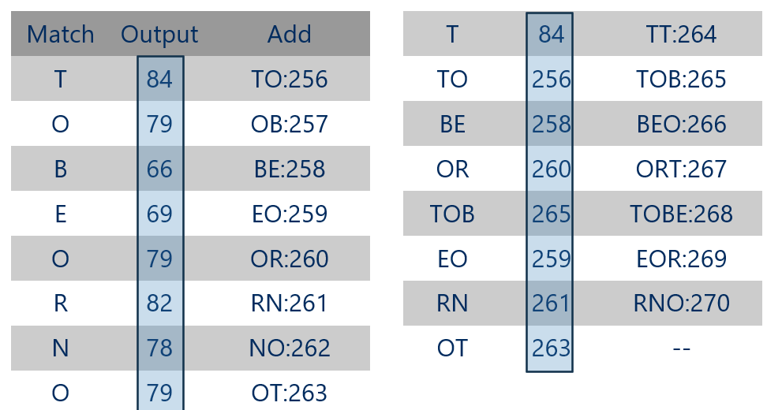
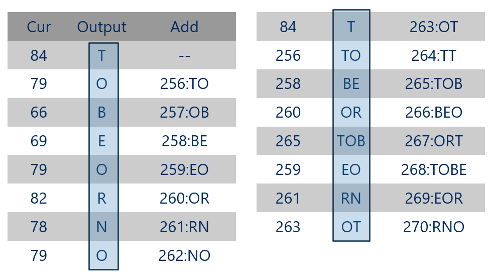

# CS 1501 - Lab #4 (LZW Compression)[^1]

## Table of Contents

- [Overview](#overview)
- [LZW Compression](#lzw-compression)
- [Tasks](#tasks)
- [Testing](#testing)
- [Submission](#submission)

## Overview

 __Purpose__: In this lab, you will complete the implementation of the LZW compression algorithm.

The starter project has been provided to you with the following content:

- `LZWmod.java` - The file you will be editing includes four places, marked by `TODO` comments, where you must finish the code implementation.
- `TSTmod.java` - The compression codebook for the algorithm.
- `\Test files` - A folder containing some files to try the compression algorithm.
- `code.txt` - A text file to try the compression algorithm on.

The rest of the files are either for outputting the compression and expansion results, for the Ternary Search Trie data structure that the compression codebook uses, or scripts for compressing and expanding. __Do not modify them__.

## LZW Compression

The LZW compression algorithm is a lossless compression algorithm with a fixed-length codeword for variable-size code blocks.

It compresses files by removing repeated chunks in the files and replacing them with a fixed-length codeword. The algorithm will generate the compression and expansion codebook at runtime, so the codebook is not stored with the compressed file. The way it compresses allows for excellent compression performance on files that contain a lot of repetitive data, often used for compressing TIFF and GIF image files.

For example, to compress the string: *TOBEORNOTTOBEORTOBEORNOT*


The compressed file will be the contents of the `output` column in the chart above. Using the output from compression, the expansion will output the original like the following:



The algorithm will be covered in more detail during your recitation and lecture.

## Tasks

In this lab, we will be implementing the LZW Compression algorithm.

You would first modify the `TSTmod.java` file to make it take `StringBuilder` as input rather than regular `String`. Then, you'll modify `LZWmod.java` to finish the algorithm implementation.

**Hint**: In the `compress` method, the `StringBuilder current` should be different at the end of each iteration of the compression loop depending on whether `current` was found in the codebook. If it is found, the next character from the input will be appended to `current`.  If not found, `current` will be modified so that only its last character is left for the next iteration.

## Testing

Compile the completed Java file from your lab directory. Once compiled, you can compress and decompress using the following commands:

Note: replace `FILE` with the name of the actual file you want to test, including its relative path and extension (e.g., `"\Test files\large.txt"`)).

``` powershell
cd #YOUR_LAB4_DIRECTORY\Code
# If you're on Windows, do not use Powershell for this; it will not work. Use the Command Prompt `cmd.exe` instead.
javac *.java
java LZWmod - < FILE > FILE.zip
java LZWmod + < FILE.zip > FILE.recovered
```

Then, to test your output:

``` powershell
# for Windows Users
fc /b FILE FILE.recovered
```

``` bash
# for MacOS/Linux Users
diff FILE FILE.recovered
```
If your implementation is correct, and you're on Windows, it should say `FC: no difference encountered`. If you're on MacOS/Linux, it will not output anything.

I've provided a script for you to do all the above commands.

``` powershell
# for Windows Users
# Do not use Powershell for this; it will not work. Use Command Prompt (`cmd.exe`) instead
test.bat FILE
```

``` bash
# for MacOS/Linux Users
# If you're running this for the first time
chmod +x ./test.sh
# For the script execution
./test.sh FILE
```

To run the program directly from VS Code, [you'll need to configure the launch.json file to take command-line arguments](https://code.visualstudio.com/docs/editor/debugging). Add the following to the end of the run-time configuration JSON list.

`"cwd": "${workspaceFolder}/Code"` to make sure that VS Code launch from the correct file directory.

`"args": ["<", "FILE", ">", "FILE.zip"]` to debug the `compress` method or

`"args": ["<", "FILE.zip", ">", "FILE.recovered"]` to debug the `expand` method.


## Submission

- The only files you can modify are `TSTmod.java` and `LZWmod.java`.
- `commit` and `push` the finished code to your GitHub repository. You can check the following [page](https://code.visualstudio.com/docs/sourcecontrol/github) to set up GitHub access directly from VS Code. If you think the commit command hangs in VS Code, it probably asks for a commit message in an open file. You would then need to enter a message and close the file before it can commit to GitHub.
- Submit your Github repository to GradeScope for automatic grading.
  
Note: If you use an IDE, such as NetBeans, Eclipse, or IntelliJ, to develop your programs, make sure the programs will compile and run on the command line before submitting – this may require some modifications to your program (e.g., removing package information).
[^1]: Contributed by [Alex Zhou](https://github.com/yuz727)
